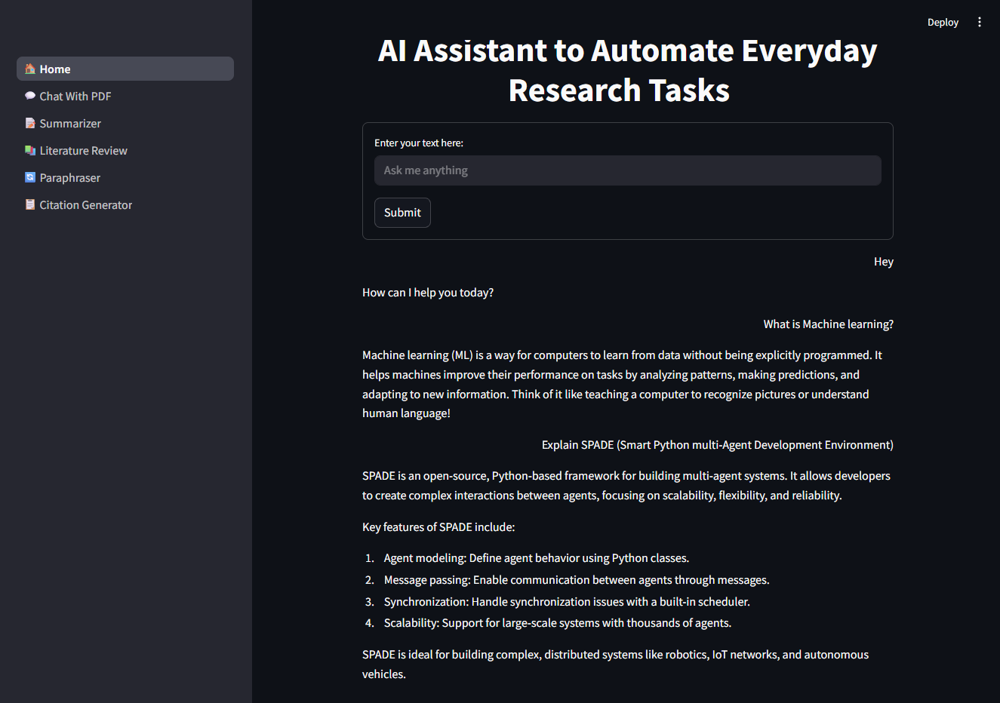

# AcademicMAS -  A Multi-Agent Research Assistant 
AcademicMAS is a multi-agent system developed as part of the course requirements for "Agent-Based Software Engineering" (SENG 696) at the University of Calgary. 

## Prepared by:
- <span style="font-size:20px"> **Name:** Md Tayeb Adnan </span> <br> 
- <span style="font-size:20px"> **UCID#** 30292333 </span> <br>
- **Course Title:** Agent-Based Software Engineering  <br>
- **Course Code:** SENG 696  <br>
- **Instructor:** Professor Behrouz Far  <br>
- University of Calgary | Fall 2025

## 🧾 Overview 
The Multi-Agent Research Assistant (Academic MAS) automates key academic research tasks. It uses specialized agents to parse PDFs, chat with PDFs, search for relevant literature, summarize content, paraphrase text, and generate citations.




## 🧰 Tools & Libraries Used

| Tool/Library                        | Purpose                                                |
|-------------------------------------|--------------------------------------------------------|
| **Python**                          | Programming language for developing the system        |
| **SPADE** | Smart Python-based solution for multi-agent systems |
| **SPADE LLM** | Multi-Agent system with LLM integration              |
| **LangChain**                       | RAG pipeline, QA Chain                                |
| **Transformers**                    | Model & tokenizer loading                             |
| **Sentence Transformers**           | Chunk embeddings                                      |
| **Streamlit (optional)**            | For UI (if used)                                      |
| **PyMuPDF / python-docx**           | PDF/Docx file parsing                                 |
| **VS Code**                         | Development environment                               |


## 🤖 Agents
| Agent                     | Purpose                                                                 | Input                                               | Output                                                     |
|---------------------------|-------------------------------------------------------------------------|-----------------------------------------------------|------------------------------------------------------------|
| **Manager / Orchestrator** | Central planner and task dispatcher                                     | User prompt or uploaded file metadata               | Final report artifact, status messages                     |
| **PDF Parser**             | Extract text, metadata, figures, and sections from uploaded PDFs       | PDF file path                                       | Document object with sections, figures, DOI, etc.          |
| **Literature Search**      | Discover relevant literature for a query                                | Query keywords and constraints                      | Ranked list of paper metadata and links                    |
| **Paraphraser**            | Paraphrase a paragraph (from PDF or text box)                           | Paragraph (text input from PDF or text box)          | Paraphrased version of the input text                      |
| **Summarizer**             | Generate concise summaries of research documents or topics             | Retrieved content from Knowledge Base               | Structured summaries: abstract, methods, results, etc.     |
| **Citation**               | Manage references and citation insertion                               | Completed research report                           | BibTeX-formatted citations, references.bib, clickable links|

## 📁 Project Structure
'''ai-agents-system/
├── app.py # FastAPI application
├── requirements.txt # Python dependencies
├── Dockerfile # Container configuration
├── docker-compose.yml # Multi-container setup
├── .env.example # Environment template
├── .gitignore # Git ignore rules
├── graph/
│ └── graph.py # LangGraph workflow orchestration
├── agents/
│ ├── agent1_summarizer.py # Document summarization
│ ├── agent2_query_responder.py # Document-based Q&A
│ ├── agent3_internet_agent.py # Web search
│ └── agent4_manager.py # Intelligent routing
└── README.md # This documentation'''

## 🚀 Quick Start
### Prerequisites
- Python 3.11+
- SPADE 3.3.0+
- SPADE_LLM
- Docker (optional)
- Groq API Key

### 1. Clone and Setup
```bash
git clone https://github.com/mdtayebadnan/AcademicMAS.git
cd academicmas

# Create virtual environment
python -m venv venv
source venv/bin/activate  # On Windows: venv\Scripts\activate

# Install dependencies
pip install -r requirements.txt
```

### 2. Environment Configuration
```bash
# Create environment file
cp .env.example .env

# Add your API key to .env
echo "GROQ_API_KEY=your_groq_api_key_here" >> .env
```
### 3. Run the Application
```bash
streamlit run app.py
```

## Documentation
<a href="https://github.com/mdtayebadnan/AcademicMAS/blob/main/reports/First_Report.pdf">First Assignment</a> <br>
<a href="https://github.com/mdtayebadnan/AcademicMAS/blob/main/reports/Second_Report.pdf">Second Assignment</a>

